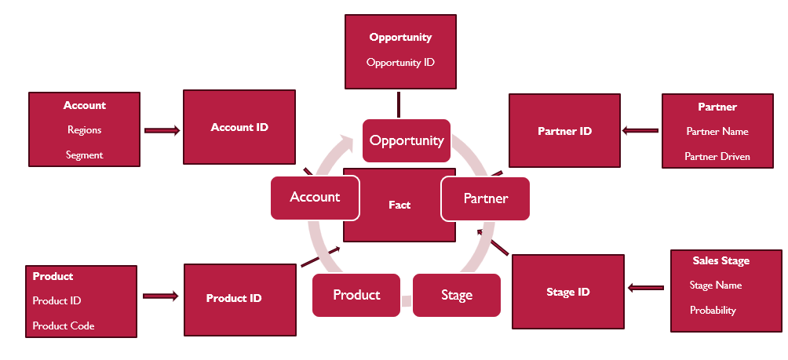

#  Opportunity Tracking Dashboard  

###  Business Intelligence Project by [Rejoice Nwocha](https://www.linkedin.com/in/rejoice-nwocha-32a0a8218)

---

##  Overview
The **Opportunity Tracking Dashboard** is a fully Excel-based analytics system built to monitor **revenue performance, partner contribution, and regional growth**.  
Every calculation, chart, and metric was developed inside Excel using formulas, PivotTables, structured tables, and clean dashboard design principles.

---

## Objectives
- Integrate multiple business tables into one unified **merged fact sheet**  
- Build a clear **schema structure** (Fact–Dimension) for scalable analysis  
- Transform static data into **interactive dashboards** and **insight summaries**  
- Deliver actionable intelligence for decision-makers — without external BI tools  

---

##  Data Model (Star Schema)

**Fact Table**
- `Fact_Opportunity` → Opportunity ID, Account ID, Partner ID, Product ID, Stage ID, Revenue, Probability, Segment, Region  

**Dimension Tables**
- `Dim_Account` → Region, Segment, Customer details  
- `Dim_Partner` → Partner Type, Category, Relationship  
- `Dim_Product` → Product Code, Category, Cost  
- `Dim_Stage` → Stage Name, Win Probability  

 [Merged Fact Sheet](./data/merged_fact_sheet.xlsx)

---

##  Business Insight Summary
A separate sheet consolidates **15 strategic business questions**, each linked to a different analytical worksheet.  

| Focus Area | Key Insight |
|-------------|--------------|
| Revenue Channels | Partner channel drives **69 %** of total revenue |
| Regional Growth | **East** region dominates Partner sales; **Central** leads Direct |
| Conversion Rate | Both channels average **3 % conversion** |
| Deal Cycle | Partner deals close slower but yield higher value |
| Strategic Mix | Direct for quick wins, Partner for sustainable growth |

 [Business Insight Summary Sheet](./data/business_insight_summary.xlsx)

---

##  Workbook Structure
| Sheet Name | Purpose |
|-------------|----------|
| `Dashboard` | Main KPI visualization |
| `Revenue by Channel` | Partner vs Direct analysis |
| `Regional Performance` | Region-level comparison |
| `Top Partners` | Ranking and contribution analysis |
| `Conversion Rate` | Pipeline efficiency metrics |
| `Segment Analysis` | Performance by customer segment |
| `Business Insight` | Key questions + answers summary |

---

##  Core Excel Features Used
| Category | Techniques |
|-----------|-------------|
| **Data Modeling** | Structured tables, relational joins via formulas |
| **Analytics** | PivotTables, SUMIFS, AVERAGEIFS, COUNTIFS |
| **Automation** | Named ranges, dynamic arrays, data validation |
| **Visualization** | Donut, column, and combo charts with slicer controls |
| **Design** | Magenta & gray theme, consistent typography, layout grid |

---

##  Dashboard Preview

###  Highlights
- KPI cards showing total revenue, win rate, partner share  
- Interactive slicers for region, segment, and channel  
- Trend charts for monthly performance  
- Clear business narrative linking visuals to strategy  

---

##  Key KPIs
| KPI | Formula Example |
|-----|------------------|
| **Total Revenue** | `=SUM(Fact_Opportunity[Revenue])` |
| **Conversion Rate** | `=Closed_Won / Total_Opportunities` |
| **Win Rate by Channel** | `=SUMIFS(Revenue, Channel, "Partner") / Total_Revenue` |
| **Partner Contribution** | `=Partner_Revenue / Total_Revenue` |
| **Regional Growth** | `=SUMIFS(Revenue, Region, "East")` |

📁 [Formula Definitions](./assets/formula_definitions.txt)

---

## 📂 Repository Map
